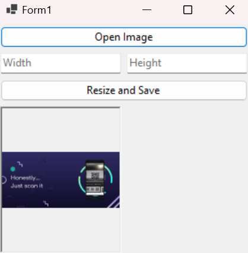

# ImageResizer

- **Description:** ImageResizer is a simple Windows Forms application that allows users to open image files, resize them, and save them in different formats.

## Features
- **Open Images:** Supports opening image files in formats including JPG, JPEG, PNG, BMP, and GIF.
- **Resize Functionality:** Allows the user to specify new dimensions for the image.

## Image

## Usage
- **Open an Image:** Click the 'Open Image' button and select an image file.
- **Enter New Dimensions:** Input the desired width and height in the provided text boxes.
- **Resize and Save:** Click the 'Resize and Save' button, choose the save location and format, and save the resized image.

